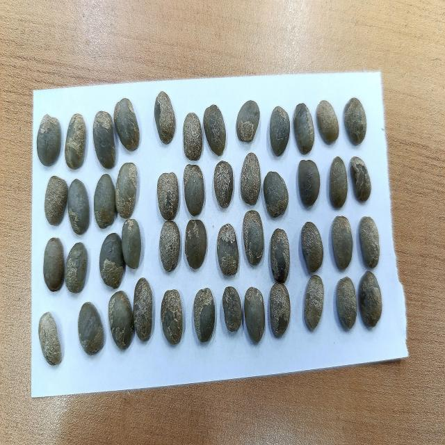
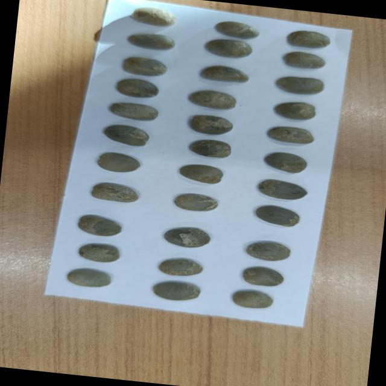

# Detección de Enfermedades en el Café

Este proyecto implementa un sistema de detección de enfermedades en plantas de café utilizando YOLOv8. El modelo es capaz de identificar y clasificar plantas de café en dos categorías: sanas y enfermas.

## Características

- Detección en tiempo real de enfermedades en plantas de café
- Clasificación binaria: sano vs enfermo
- Fácil de usar con una API simple
- Visualización de resultados con cuadros delimitadores

## Requisitos

- Python 3.8 o superior
- OpenCV
- Ultralytics (YOLOv8)
- Numpy

## Instalación

1. Clona el repositorio:
   ```bash
   git clone https://github.com/Joshue-24/Disease-Detection-in-Coffee.git
   cd Disease-Detection-in-Coffee
   ```

2. Instala las dependencias:
   ```bash
   pip install -r requirements.txt
   ```

## Uso

1. Coloca tus imágenes en la carpeta `images`
2. Ejecuta el script de detección:
   ```bash
   python sest.py --source images/ --output results/
   ```

## Ejemplos

### Planta de café sana


### Planta de café enferma


## Estructura del Proyecto

```
deteccion-de-enfermedades-cafe/
├── sest.py             # Script principal de detección
├── sest.pt             # Modelo YOLOv8 entrenado
├── README.md           # Este archivo
└── images/             # Carpeta para imágenes de prueba
```

## Entrenamiento

Si deseas entrenar tu propio modelo:

1. Prepara tu conjunto de datos en formato YOLO
2. Configura el archivo `data.yaml`
3. Ejecuta el entrenamiento:
   ```bash
   yolo task=detect \
        mode=train \
        model=yolov8n.pt \
        data=data.yaml \
        epochs=100 \
        imgsz=640
   ```

## Contribución

Las contribuciones son bienvenidas. Por favor, envía tus pull requests.

## Licencia

Este proyecto está bajo la Licencia MIT.
